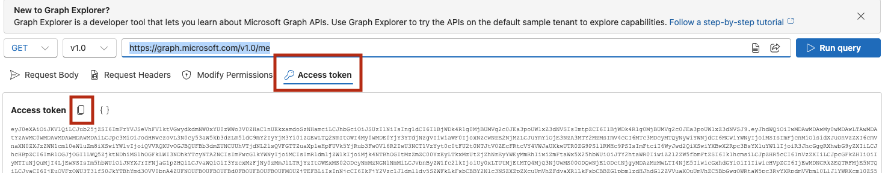

# AD Users and Groups Enrichment Tool

This project **iqms_ad_export** reads AD group information from CSV file(s), resolves group IDs via Microsoft Graph API, retrieves all group members (using pagination), and writes enriched output files for downstream analysis.

The program expects an input file, for example `persona_ad_sg_mapping.csv`, with the following columns:

- persona (name of the IQMS persona used to assign a user to specific IQMS groups)
- AD Security Group (name of the AD group / entitlement; this can be either displayName or CN)
- DocUnit (the IQMS DocUnit to which the user belongs)

Unfortunately, the data provided by business colleagues is not always in the expected relational format (see [mapping_persona_sg/ID now-Personas mapping.xlsx](mapping_persona_sg/ID%20now-Personas%20mapping.xlsx)).
Transform it first with [tools/02_process_persona_mapping.py](tools/02_process_persona_mapping.py).

## Using script 02_process_persona_mapping.py

The script has two main purposes:

1. Create relational output with the following columns:
   1. persona (IQMS persona)
   2. AD Security Group (related security group for this persona and DocUnit)
   3. DocUnit (DocUnit where this persona is used)
2. Extract the DocUnit identifier from the AD Security Group name (last segment) and match it to the real IQMS DocUnit name, for example:
   `ef.u.iqms_qms_internal_task_owner_bcc_ag_basel_ch01  -->  BCC AG Basel (CH01)`

To do this, the script expects three input files:

1. Provided business input data (see [mapping_persona_sg/ID now-Personas mapping.xlsx](mapping_persona_sg/ID%20now-Personas%20mapping.xlsx)); please verify the sheet structure
2. All **existing** DocUnits (see [conf/docunits.csv](conf/docunits.csv)) — ensure this file contains all IQMS DocUnits
3. A list of pseudo DocUnits that can be treated as global (see [conf/docunits_global.csv](conf/docunits_global.csv))

The output file becomes the input for [get_users_and_groups_from_ad.py](get_users_and_groups_from_ad.py), which retrieves IQMS users for each persona and DocUnit.
The default output file name is [exports/persona_sg_mapping.csv](exports/persona_sg_mapping.csv).

**Please validate the generated file before continuing.**
Not every persona is mapped to a specific DocUnit (for example, global roles). These DocUnits are named `Global_...`.
If a DocUnit cannot be found (for example, a new DocUnit was created in IQMS), the value `ERROR: Docunit not found` is written.
In that case, update [conf/docunits_global.csv](conf/docunits_global.csv) and/or [conf/docunits.csv](conf/docunits.csv).

## Using Main Script get_users_and_groups_from_ad.py

### Program Purpose

The script `get_users_and_groups_from_ad.py` is used to:

- read input rows containing `persona`, `AD Security Group`, and `DocUnit`
- resolve each group against Microsoft Graph (technical and non-technical names)
- maintain/update a local mapping file for resolved groups by using group id instead displayName
- retrieve group members and enrich rows with user details
- create reports and logs for traceability

### Prerequisites

#### 1) Python and dependencies

- Python 3.10+ recommended
- Install dependencies from `requirements.txt`

Example:

```powershell
pip install -r requirements.txt
```

#### 2) Bearer token in `.env`

Create or update `.env` in the project root with:

```env
BEARER_TOKEN=<your_access_token>
USE_PROXY=true
NO_PROXY=false
```

How to generate this token is explained below: [How to Get the Bearer Token](#how-to-get-the-bearer-token)

### 3) Input, mapping, output files

#### Input file (required)

- Typical file: `persona_ad_sg_mapping.csv`
- Required columns:
  - `persona`
  - `AD Security Group`
  - `DocUnit`

#### Mapping file (required, auto-updated)

- File: `conf/group_id_mapping.csv`
- Required header:

```csv
no,displayName,onPremisesSamAccountName,mailNickname,id
```

The script appends new mapping rows and logs unresolved groups with error markers.

#### Output file(s)

- Single run output: user-defined via `-o`
- Batch output folder: `exports/enriched/`
- Enriched output columns:
  - `persona`
  - `AD Security Group`
  - `DocUnit`
  - `User`
  - `Alias`
  - `User Status`

## Folder Structure and Expected Files

Main structure in this project:

```text
iqms_ad_export/
├─ get_users_and_groups_from_ad.py              # Main program
├─ README.md                                    # This documentation
├─ requirements.txt                             # Python dependencies
├─ .env                                         # Runtime environment values (token, proxy)
├─ conf/
│  └─ group_id_mapping.csv                      # Group mapping cache, updated by script
├─ docs/
│  ├─ microsoft_graph_api_anforderungen.md      # Graph API and permission details
│  └─ graph-explorer-access-token.png            # Screenshot for Graph Explorer token tab
├─ exports/
│  ├─ splitted/                                 # Batch input CSV files
│  └─ enriched/                                 # Batch output CSV files
├─ logs/
│  └─ get_users_and_groups_from_ad_*.log        # Timestamped execution logs per run
└─ reports/
   └─ observations_*.csv                         # Timestamped structured observations per run
```

## How to Run

Default behavior:

- Running the script without arguments starts interactive single-file mode.
- Use `--batch` for non-interactive batch processing.

### Single-file mode

```powershell
python get_users_and_groups_from_ad.py -i persona_ad_sg_mapping.csv -o test_output.csv
```

Interactive single-file mode is also supported. If `-i` and/or `-o` are missing, the script prompts for the missing paths.

Output constraints in single-file mode:

- output file must be in the same folder as input file
- output filename must be different from input filename

Example (interactive prompts for both paths):

```powershell
python get_users_and_groups_from_ad.py
```

Example (prompts only for output because input is already provided):

```powershell
python get_users_and_groups_from_ad.py -i exports/persona_ad_sg_mapping.csv
```

### Batch mode

```powershell
python get_users_and_groups_from_ad.py --batch
```

Optional batch arguments:

```powershell
python get_users_and_groups_from_ad.py --batch --input-dir exports/splitted --output-dir exports/enriched --report exports/enrichment_report_msgraph.md
```

## How to Get the Bearer Token

For testing, you can obtain a temporary token from Microsoft Graph Explorer:

1. Open [https://developer.microsoft.com/en-us/graph/graph-explorer](https://developer.microsoft.com/en-us/graph/graph-explorer)
2. Sign in with your organization account
3. Run a simple query, e.g. `https://graph.microsoft.com/v1.0/me`
4. Open the **Access token** tab
5. Copy the token
6. Paste it into `.env` as `BEARER_TOKEN=<token>`

Reference image:



Important notes:

- Graph Explorer tokens are temporary and expire quickly.
- When expired, the script will fail with 401 errors.
- For stable automation, use app registration/service principal and proper OAuth flow.

For enterprise setup details (tenant/app registration, permissions, consent, proxy), see:

- [docs/microsoft_graph_api_anforderungen.md](docs/microsoft_graph_api_anforderungen.md)
